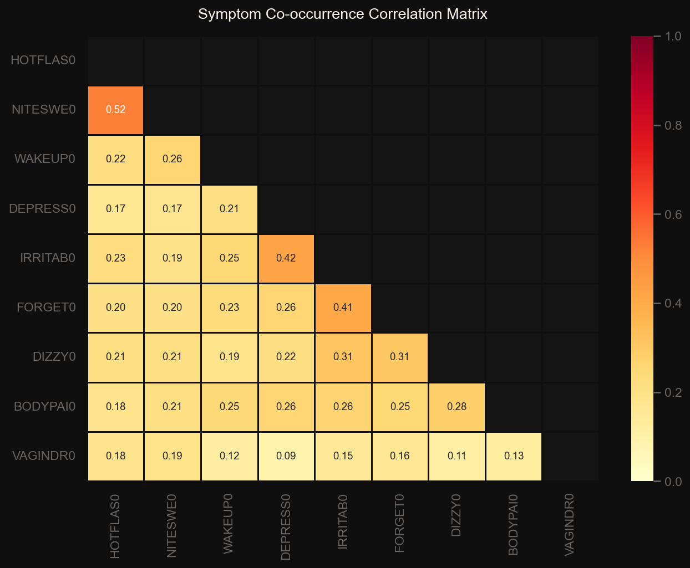
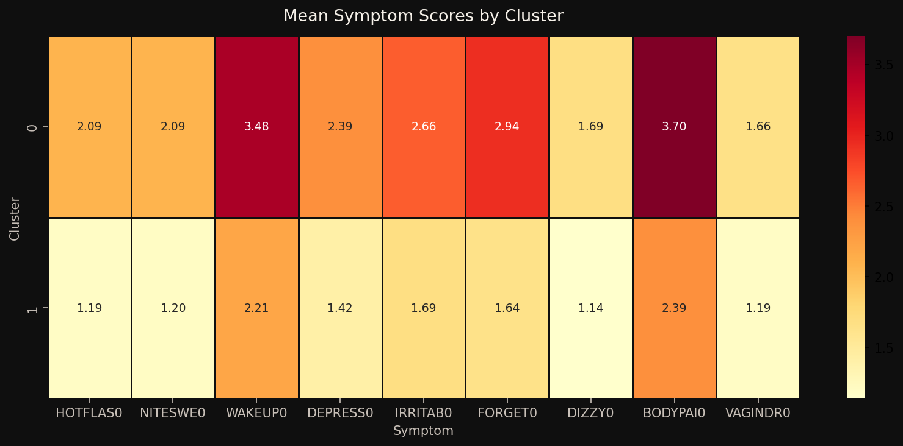
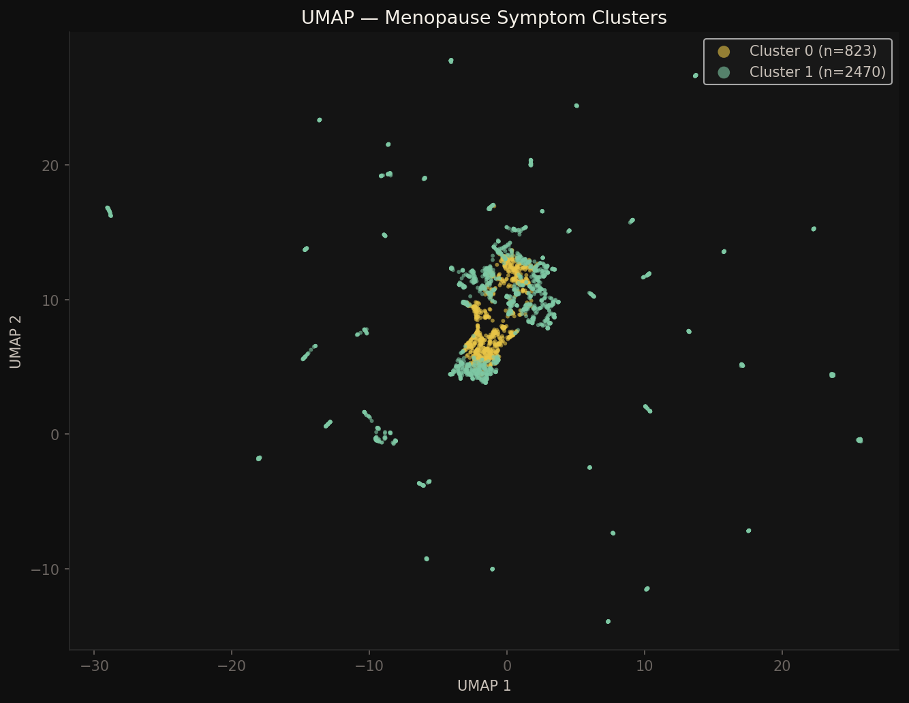

# SWAN Menopausal Symptom Clustering
### ML Pattern Recognition in Menopausal Symptom Burden

> Applying unsupervised machine learning to the SWAN baseline dataset to identify distinct symptom burden profiles among women in the menopausal transition.

## Overview

Menopause is a universal experience for women, yet the severity of symptoms varies dramatically from person to person. This project uses unsupervised machine learning to ask whether that variation is random — or whether women naturally fall into distinct symptom burden groups, and if so, what drives those differences.

Using baseline data from the Study of Women's Health Across the Nation (SWAN), a large NIH and CDC-funded longitudinal study, this analysis identifies two statistically significant symptom clusters and examines which symptoms, demographics, and physical characteristics are associated with greater menopausal burden.

This is **Project 01** of a two-project PhD application portfolio exploring ML pattern recognition across the female hormonal lifespan.

## Research Questions

1. Do women in the menopausal transition naturally fall into distinct groups based on their symptom experiences?
2. Which symptoms are most responsible for separating high and low burden women?
3. What demographic and physical characteristics are associated with experiencing greater menopausal symptom burden?

## Dataset

| Detail | Value |
|---|---|
| Source | [SWAN Baseline Dataset via ICPSR](https://www.icpsr.umich.edu) |
| Sample size | 3,293 women |
| Visit | Baseline (single cross-sectional wave) |
| Symptom variables | 9 (hot flashes, night sweats, sleep disturbance, depression, irritability, forgetfulness, dizziness, body pain, vaginal dryness) |
| Covariates | Age, BMI, race, menopausal status |

> Raw data files are not included in this repository. Access the SWAN baseline dataset via ICPSR (free account required, data use agreement).

## Key Findings

**Two distinct symptom burden profiles exist within the SWAN baseline sample, validated through permutation testing (p=0.0099).**

| | Cluster 0: High Burden | Cluster 1: Low-Moderate Burden |
|---|---|---|
| **n** | 823 (25%) | 2,470 (75%) |
| **Hot flashes (mean)** | 2.09 | 1.19 |
| **Body pain (mean)** | 3.70 | 2.39 |
| **Forgetfulness (mean)** | 2.94 | 1.64 |
| **BMI (mean)** | 30.24 | 27.60 |
| **Menopausal stage** | More early perimenopausal | More premenopausal |

**Forgetfulness, not hot flashes, is the strongest differentiator between high and low burden women** — outranking vasomotor symptoms that are more commonly associated with menopausal burden in clinical settings.

**Higher BMI is consistently associated with greater symptom burden**, consistent with the clinical understanding that adipose tissue modulates hormonal activity.

**Age was not a significant differentiator** between clusters (p=0.13), suggesting symptom burden is not simply a function of how far along a woman is in the aging process.

## Figures

### Symptom Co-occurrence Correlations
Three symptom pairs showed strong co-occurrence, suggesting natural subgroup structure in the data: hot flashes and night sweats, depression and irritability, and irritability and forgetfulness.



### Cluster Symptom Profiles
Mean symptom scores across both clusters. Cluster 0 (high burden) shows consistently elevated scores across all nine symptom domains.



### UMAP Visualization
Dimensionality reduction showing the two-cluster structure in symptom space. Each point represents one woman, colored by cluster assignment.



## Results Summary

| Finding | Value |
|---|---|
| Optimal clusters | 2 |
| Permutation test p-value | 0.0099 |
| Top differentiating symptom | Forgetfulness (importance=0.069) |
| BMI difference between clusters | 30.24 vs 27.60 (p<0.001) |
| Age difference between clusters | Not significant (p=0.13) |

## Tech Stack

| Category | Tools |
|---|---|
| Language | Python 3.12 |
| Data | pandas, NumPy |
| ML | scikit-learn (K-Means, Random Forest, permutation importance) |
| Visualization | matplotlib, seaborn, umap-learn |
| Infrastructure | AWS S3, Terraform |

## Project Structure

```
swan-menopause-clustering/
├── swan_eda.py                  # exploratory data analysis
├── swan_clustering.py           # K-Means clustering + UMAP
├── swan_baseline_clean.csv      # cleaned dataset (not raw data)
├── swan_clustered.csv           # dataset with cluster labels
├── fig1_symptom_distributions.png
├── fig2_symptom_correlation.png
├── fig3_symptoms_by_meno_status.png
├── fig4_symptoms_by_race.png
├── fig5_optimal_clusters.png
├── fig6_cluster_profiles.png
├── fig7_cluster_bars.png
├── fig8_race_by_cluster.png
├── fig9_umap.png
└── README.md
```

## Author

**Mariama** — Software Engineer · Independent Researcher · Founder, Sistas in Dev Collective
Preparing for PhD in Biomedical Informatics · Atlanta, GA

*Part of a two-project portfolio on ML pattern recognition across the female hormonal lifespan. See also: [Female Hormonal Health ML Pipeline](https://github.com/Mariama-Lukata/PM-Neurobiological-Sensitivity-Research-Cloud-Infrastructure)*